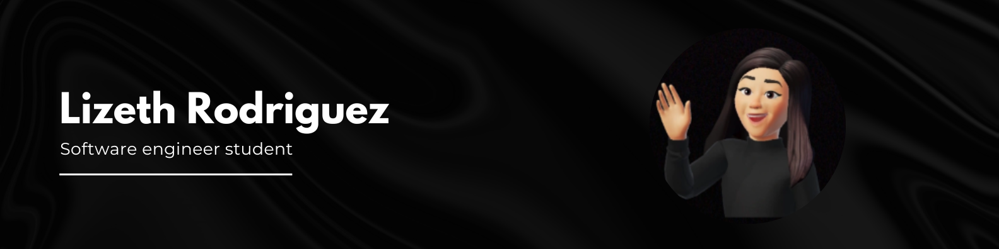

<!--### Hi there 👋-->

<h1 align="left"> 
  Hi everyone!👋
</h1>

Hello everyone, I'm a software engineering student, and I'm excited to share my passion for programming with you. In this repository, you can find a collection of projects, both personal and school-related, that I've been working on. I hope you find something interesting and useful here! Feel free to explore and contribute. Thank you for visiting my profile!

<h2>📫 How to reach me </h2>
<ul>
  <li>📧 lizeth1354@outlook.es</li>
</ul>

<h2>💻 Technical Skills </h2>

  
  
  
  
  
  
  
  

<!--
**lizeth45/lizeth45** is a ✨ _special_ ✨ repository because its `README.md` (this file) appears on your GitHub profile.

Here are some ideas to get you started:

- 🔭 I’m currently working on ...
- 🌱 I’m currently learning ...
- 👯 I’m looking to collaborate on ...
- 🤔 I’m looking for help with ...
- 💬 Ask me about ...
- 📫 How to reach me: ...
- 😄 Pronouns: ...
- ⚡ Fun fact: ...
-->
